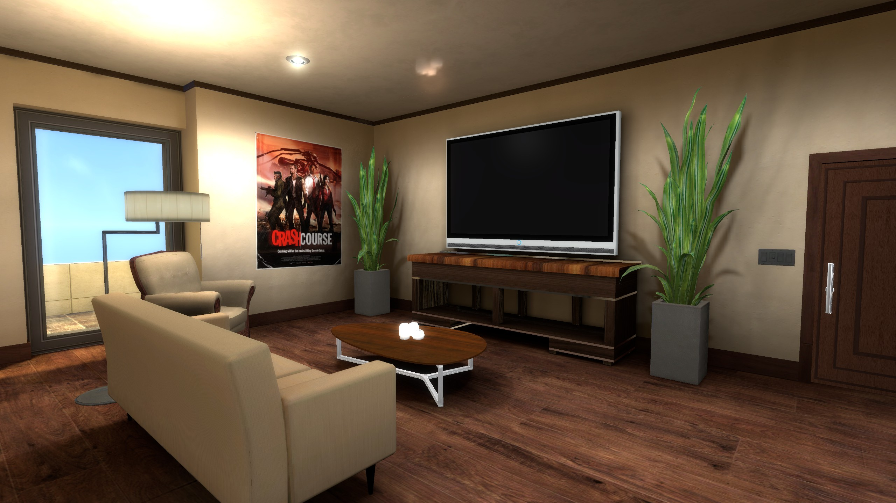
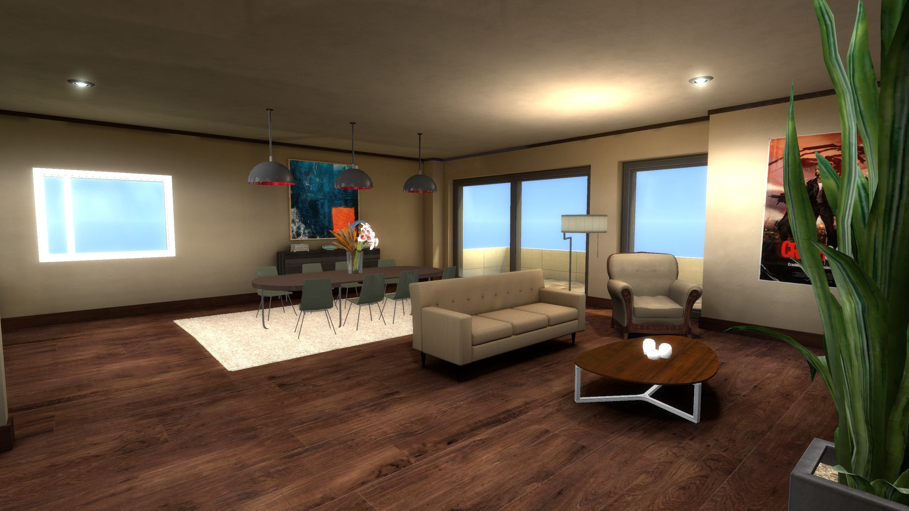
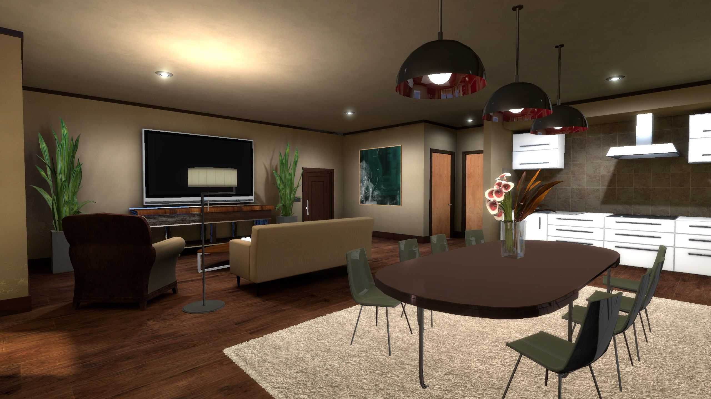
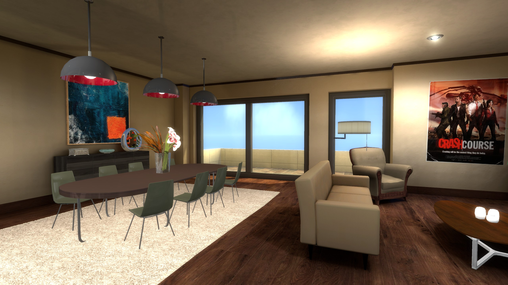
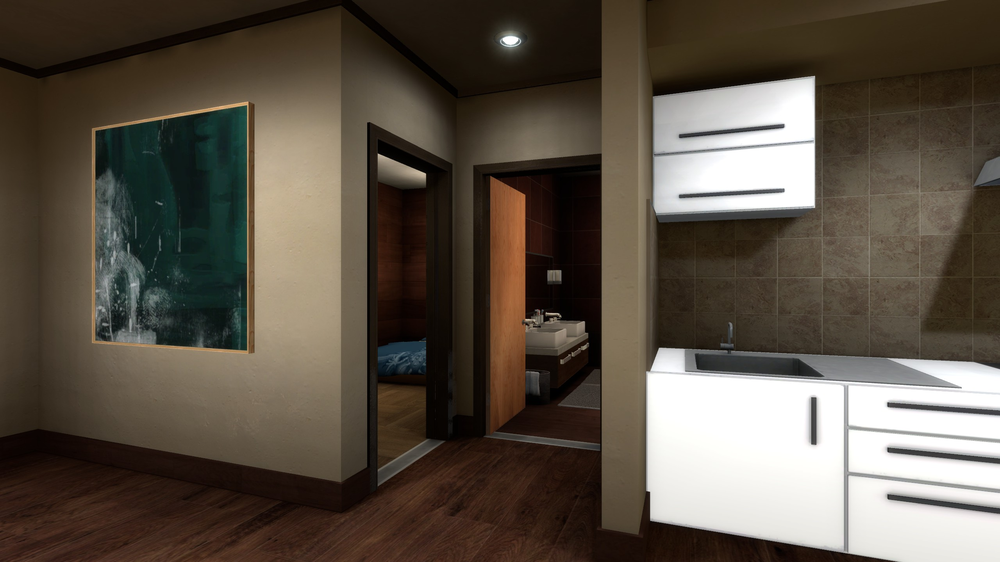
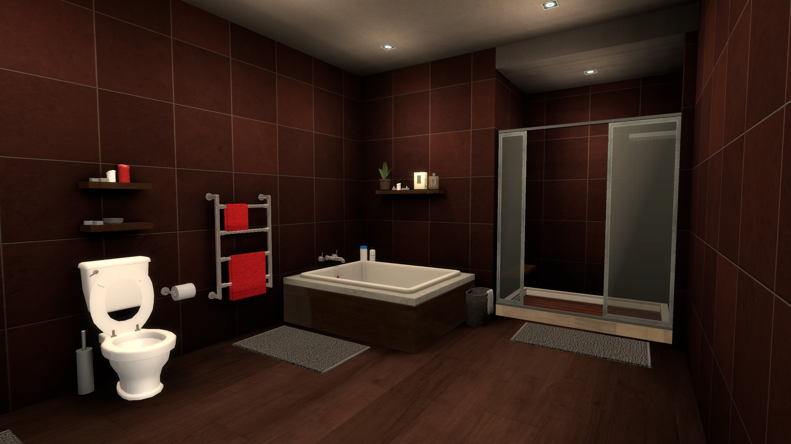
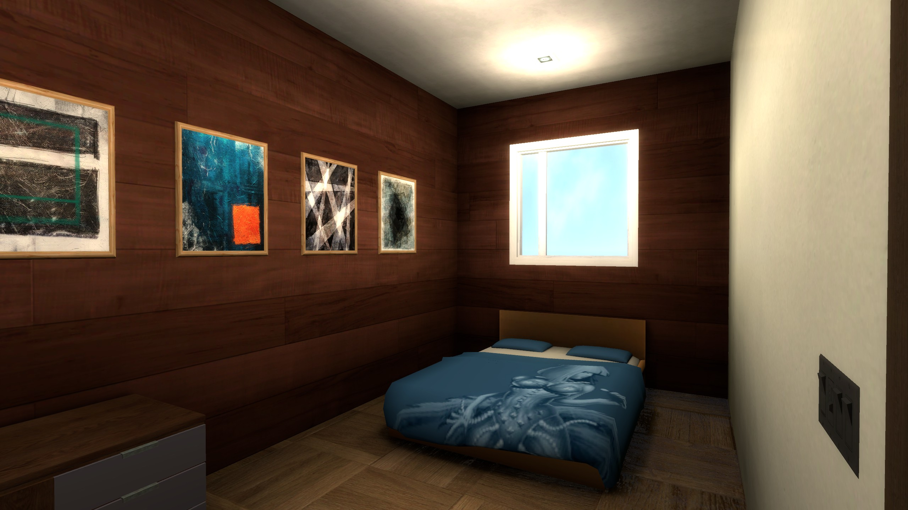

# Comfortable apartment

This scene made for Source Engine (1) represents a little comfortable apartment. You are free to use it in your own projects, but please, give me a credit.

Be aware that you may need to increase the lightmap scale of the map brushes to ~16 if you are going to integrate it into a big map.

## Compilation

**VBSP:** `-game $gamedir $path\$file`

**VVIS:** `-game $gamedir $path\$file`

**VRAD:** `-both -final -staticproppolys -textureshadows -staticproplighting -StaticPropBounce 10 -TextureShadows -aoscale 1.5 -bounce 512 -ambientocclusion -softencosine -threads 16 -game $gamedir $path\$file`

⚠️ Please note that because this map was at first, a lighting experiment, the compile parameters may be a bit overkill. I think you can easily reduce the number of bounces and ambient occlusion scale to get a faster compile without losing much quality. But you shouldn't touch the to lightmap scale if you do not plan to intregrate this map into a bigger one.

## How can I get the materials and models?

All the materials and models are packed into the [Steam Workshop released .bsp file](https://steamcommunity.com/sharedfiles/filedetails/?id=3387404618). Because it not a creation of mine, I can't legitly provide them on this repo. But you can extract them from the .bsp file using tools like [VIDE](https://developer.valvesoftware.com/wiki/VIDE)

## Screenshots

## License

This project is licensed under the MIT License - see the [LICENSE](LICENSE) file for details.